# Brendon Smith

### Software Engineer | AI-first Web, Mobile, XR, and MCP Systems

Hello, I am Brendon Smith, a senior software engineer focused on building high-impact products across web, mobile, 3D, and XR. I work across front-end architecture, rapid prototyping, creative technology, and product delivery, with experience spanning media, gaming, ecommerce, content, biomedical, and software.

## About Me

- 15+ years building production software and customer-facing products
- Strong in React, React Native, TypeScript, Storybook, design systems, and scalable UI architecture
- Experienced with AI-assisted workflows, LLM applications, agents, and MCP-powered tooling
- Build immersive experiences with Babylon.js, Three.js, React Three Fiber, Unity, 8th Wall, and WebXR
- Comfortable moving from concept to prototype to production comfrotable working with general ambguity and little direction 

## Current Focus

- AI-first product development and faster engineering workflows
- Web, mobile, and XR prototyping with strong UX and practical delivery
- MCP-powered tools and automation that reduce friction and speed up iteration
- Creative engineering at the intersection of UI, 3D, AI, and storytelling

## Professional Experience

- **Principal Software Engineer** in consulting 
- **Applications Developer Level 4** at RSS, UC Davis
- **Senior Software Engineer / Interim Front-End Team Lead** at King focused on candy crush royalty 
- **Frontend Engineer** at Dictionary.com
- **Senior Software Engineer** at Akili Interactive - focused on ADHD insights react-native 
- **Senior / Front-End Engineer** at CBS Interactive - Big Brother Live feeds, CBS all access now paramount+ 
- **RIA Developer** - Hayneedle Sequoia Capital backed startup now owned by Walmart 
- **Software Engineer** - Infogroup worked on SalesGenie.com had several superbowl ads before AWS now owned by DataAxel 

## Selected Work

- Built products across streaming, gaming, search, ecommerce, content, and digital therapeutics
- Developed React and React Native applications, Storybook libraries, and reusable design systems
- Shipped AI, AR, and XR experiences using React Three Fiber, Unity, 8th Wall, and modern web tooling
- Worked closely with product, design, analytics, and engineering teams to improve usability, performance, and delivery

## Technical Focus

- **Front End:** React, React Native, TypeScript, Storybook, MUI, Ant Design, HTMX
- **AI / Automation:** LLM apps, LangChain, AI agents, MCP workflows, rapid prototyping
- **3D / XR:** Babylon.js, Three.js, React Three Fiber, Unity, 8th Wall, WebXR
- **Backend / Platform:** Node.js, Express, GraphQL, MongoDB, PostgreSQL, AWS, serverless
- **Product Areas:** CMS, ecommerce, streaming, search, gaming, biomedical, and creative tools

## Connect

- GitHub: [@seacloud9](https://github.com/seacloud9)
- LinkedIn: [Brendon Smith](https://www.linkedin.com/in/brendonsmith)
- Portfolio: [seacloud9.studio](http://seacloud9.github.io/)
- Writing: [Medium](https://medium.com/@seacloud9)
 

Me emere non potes; pulcherrima fingo

AI-first principal software engineer building web, mobile, 3D, and XR products, plus MCP-powered tools and workflows for faster prototyping and shipping.

## 📱 Platforms

---

## 🚀 WebXR

---

## 🛠 Creative & AI Tools

---

## 🎮 Game Engines

---

## 💳 Commerce

---

## ⭐ Personal Projects

