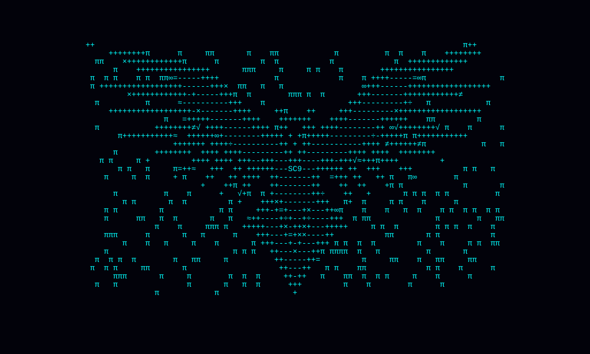

### Senior Software Engineer | Product Engineering, AI, and Immersive Experiences

I design and build thoughtful digital products across web, mobile, artificial intelligence, and extended reality.

With 15+ years of experience, I help teams move from an early concept or difficult technical problem to a usable, reliable, production-ready product. My work combines strong frontend engineering, full-stack delivery, product thinking, and a deep interest in how people experience technology.

My core strengths include:

- React, TypeScript, Next.js, React Native, and Node.js
- Product engineering and end-to-end feature ownership
- AI-assisted development, LLM applications, agents, and automation
- Data-rich interfaces, design systems, and reusable component libraries
- Three.js, Babylon.js, Unity, WebXR, and interactive 3D
- Technical consulting, prototyping, modernization, and application rescue

I work especially well with teams navigating ambiguity, building new products, or improving an existing application that has become difficult to maintain.

## What I Do

I help clients and product teams:

- Turn ideas into working prototypes and production applications
- Design and implement polished React and Next.js interfaces
- Build AI-enabled workflows with practical human oversight
- Modernize frontend architecture and component systems
- Develop mobile, 3D, WebXR, and interactive experiences
- Connect product strategy, user experience, and technical execution

## Current Focus

- AI-enabled product workflows and developer tools
- Local and cloud-based AI agents
- Human-guided automation and responsible AI experiences
- React and TypeScript product engineering
- Web, mobile, and immersive interface design
- Creative technology with practical business value

## Selected Experience

My background includes software for:

- Healthcare and digital therapeutics
- Compliance and safety operations
- Gaming and interactive entertainment
- Ecommerce and payment experiences
- Search, content, and high-traffic media
- AI tools, creative software, and immersive products

I have worked with product, design, clinical, analytics, and engineering teams to deliver software where usability, reliability, and thoughtful execution matter.

## About SeaCloud9

SeaCloud9 is my independent studio for software engineering, product development, and creative technology.

The studio brings together engineering discipline and visual imagination: practical systems, expressive interfaces, intelligent workflows, and immersive experiences that people enjoy using.

## Work With Me

I’m available for senior engineering, product development, technical consulting, frontend architecture, AI workflows, and interactive 3D projects.

- [SeaCloud9 Studio](https://seacloud9.studio) — Consulting, products, and creative technology
- [Contra](https://contra.com/brendon_smith_axke294z/) — Services, packages, and project engagements
- [LinkedIn](https://www.linkedin.com/in/brendonsmith)
- [GitHub Portfolio](https://seacloud9.github.io/)
- [Medium](https://medium.com/@seacloud9)
- [X](https://x.com/seacloud9)
  
 

Me emere non potes; pulcherrima fingo

 <a href="https://en.wikipedia.org/wiki/Information_wants_to_be_free">“Information wants to be free”</a> 

AI-first principal software engineer building web, mobile, 3D, and XR products, plus MCP-powered tools and workflows for faster prototyping and shipping.

## 📱 Platforms

---

## 🚀 WebXR

---

## 🛠 Creative & AI Tools

---

## 🎮 Game Engines

---

## 💳 Commerce

---

## ⭐ Personal Projects

